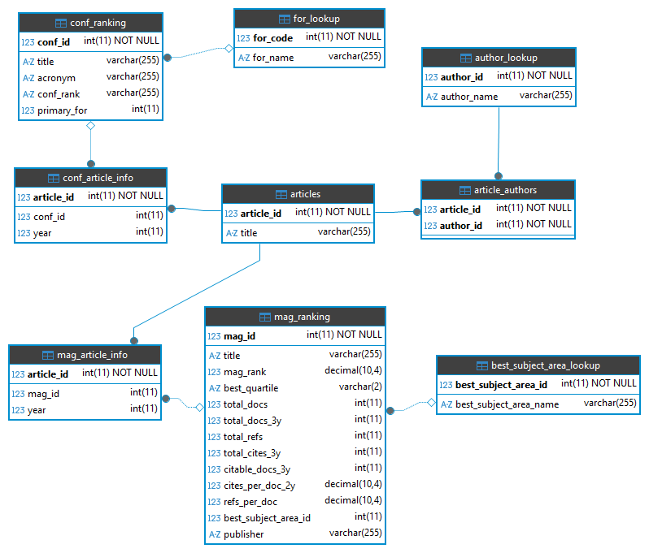

# Bib-inator

Bib-inator is a bibliographic data analysis platform built as coursework for MYE030 - Advanced Topics of Database Technology & Applications at the University of Ioannina's Department of Computer Science and Engineering.

The system integrates bibliographic records from DBLP with conference and journal rankings from iCore and Kaggle into a unified relational database. It provides a web-based interactive frontend for querying and visualizing the data.

---

## Team

| Name | Student ID |
|------|------------|
| [Dionisios - Christos Mylonas](https://github.com/MylonasDionyshsXrhstos) | [4443] |
| [Natalia Michou](https://github.com/NatOceansoul) | [4922] |
| [Spyridoula Tsafoni](https://github.com/spyrrt) | [5373] |

---

## Technology Stack

- **Database**: MariaDB / MySQL (InnoDB)
- **Backend**: Python 3, mysql-connector-python
- **Frontend**: Streamlit, Plotly
- **ETL**: Python scripts using `LOAD DATA LOCAL INFILE` and chunked `INSERT`

---

## Database Schema



### Design Decisions

The schema separates data into three layers:

**Lookup tables** hold the single-version-of-the-truth reference values:
- `FOR_LOOKUP` -> Field of Research codes and names 
- `BEST_SUBJECT_AREA_LOOKUP` -> subject area names 
- `AUTHOR_LOOKUP` -> canonical author names with generated integer PKs

**Fact tables** hold the core entities:
- `ARTICLES` -> unified article records (both conference papers and journal articles share the same table)
- `CONF_RANKING` -> conference rankings, with `primary_for` as FK to `FOR_LOOKUP`
- `MAG_RANKING` -> journal rankings, with `best_subject_area_id` as FK to `BEST_SUBJECT_AREA_LOOKUP`

**Junction / info tables** link articles to their venues and authors:
- `CONF_ARTICLE_INFO (article_id PK, conf_id, year)` -> one-to-one with conference articles
- `MAG_ARTICLE_INFO (article_id PK, mag_id, year)` -> one-to-one with journal articles
- `ARTICLE_AUTHORS (article_id, author_id)` -> many-to-many between articles and authors

---

## Data Sources

| Source | Link | Files |
|--------|------|-------|
| DBLP | https://dblp.org/ | `input_inproceedings.csv`, `input_article.csv` |
| iCore 2026 | https://portal.core.edu.au/conf-ranks/ | `iCore26_KilledColumnsForLoading.csv`, `bestSubjectArea.csv` |
| Kaggle journal rankings | https://www.kaggle.com/datasets/xabirhasan/journal-ranking-dataset?resource=download | `journal_ranking_data_raw.csv` |

The original source files should be placed in `data/original_files/`.

---

## Setup

### Prerequisites

- Python 3.8+
- MariaDB or MySQL server running locally
- `mysqldump` and `mysql` available in PATH

> Tested on Windows 10/11 and Arch Linux. Other platforms should work but have not been verified.

### Configuration

All settings live in `config.ini`:

```ini
[database]
host     = 127.0.0.1
port     = 3306
user     = root
password = root
name     = bibinatorDB

[setup]
mode                = original_files    ; original_files | backup | validate
run_tests           = true
drop_staging_tables = true
export_final_tables = false
create_backup       = true

[app]
port = 8501
mode = run    ; run | test_queries
```

### Running Setup

**Bash:**
```bash
./setup.sh
```

**Windows:**
```bat
setup.bat
```


The setup script installs Python dependencies and runs the pipeline according to `[setup] mode`:

| Mode | DB support | Description |
|------|------------|-------------|
| `original_files` | MariaDB only | Full ETL from raw source files in `data/original_files/`. Builds staging tables, applies transformations, loads final tables. |
| `backup` | MariaDB / MySQL | Restores the database from the compressed backup at `data/backup/bibinatorDB.sql.gz`. |
| `validate` | MariaDB / MySQL | Runs the test suite against an already-populated database without rebuilding anything. |

The following options control what happens after the pipeline runs:

| Option | Description |
|--------|-------------|
| `run_tests` | Runs the test suite. In `validate` mode the tests always run regardless of this setting. |
| `drop_staging_tables` | Drops all intermediate and starting tables, keeping only the nine final tables. Only applies to `original_files` mode. |
| `export_final_tables` | Exports each final table to a CSV file under `data/final_tables/`. Applies to `original_files` and `backup` modes. |
| `create_backup` | Dumps the finished database to `data/backup/bibinatorDB.sql.gz` after a successful run. Only applies to `original_files` mode. |

The backup can also be downloaded from [here](https://drive.google.com/file/d/1qxwuuVFTtq_WNSOMvrFpxiYrSafuuo0K). Place it at `data/backup/bibinatorDB.sql.gz`.


### ETL Pipeline (original_files mode)

The full pipeline (`src/setup/full_pipeline.py`) runs in stages:

1. **Starting tables** -> raw files are loaded into starting tables via `LOAD DATA LOCAL INFILE`
2. **Author processing** -> the article-author intermediate table and `AUTHOR_LOOKUP` are built from the DBLP data
3. **Intermediate tables** -> data is joined, cleaned and normalized in preparation for fuzzy matching
4. **Fuzzy matching** -> DBLP venue names are matched against the ranking files
5. **Lookup and fact tables** -> `FOR_LOOKUP`, `BEST_SUBJECT_AREA_LOOKUP`, `ARTICLES`, `CONF_RANKING`, `MAG_RANKING` are created in FK-dependency order
6. **Junction tables** -> `CONF_ARTICLE_INFO`, `MAG_ARTICLE_INFO`, `ARTICLE_AUTHORS` are loaded last

#### Fuzzy Matching

DBLP venue names and the names in the iCore and Kaggle ranking files do not match exactly (abbreviations, word order, and spelling variations). 

The matching pipeline (`src/setup/fuzzy_matching.py`) normalizes both sides before comparing: common words are abbreviated consistently, punctuation is stripped, and tokens are sorted. Normalized strings are then compared using `rapidfuzz` similarity scoring, and each article is linked to the ranking entry with the highest score above a set threshold. Matches are loaded into the final tables.

---

## Running the App

**Bash:**
```bash
./bibinator.sh
```

**Windows:**
```bat
bibinator.bat
```

The app runs according to `[app] mode`:

| Mode | Description |
|------|-------------|
| `run` | Launches the Streamlit web app at the configured port. |
| `test_queries` | Creates a temporary test database, runs all query tests against fixture data, then drops the database. |

The app launches at `http://localhost:8501` (or the port set in `config.ini`) when in `run` mode.

---

## App Features

The sidebar lets you switch between four analytical views and configure a live database connection.

### Venue Profile

Enter a conference or journal name. Displays:
- Ranking 
- Year range and total papers published
- Line chart: papers and authors per year
- Full paper list, filterable by year range

### Year Profile

Select a year. Displays:
- Summary statistics: total papers, conferences, journals, authors
- Full paper list for that year, filterable by venue type, venue name, and author

### Author Profile

Search for an author by name. Displays:
- First and last active year, total papers
- Line chart: conference papers vs journal papers per year

### Charts

Three chart types across both conferences and journals:

- **Line charts** -> papers or authors per year for a selected venue or category 
- **Bar charts** -> journals per publisher broken down by quartile, with optional publisher filter
- **Scatter plots** -> average authors per paper vs number of papers per year, for conferences or journals
